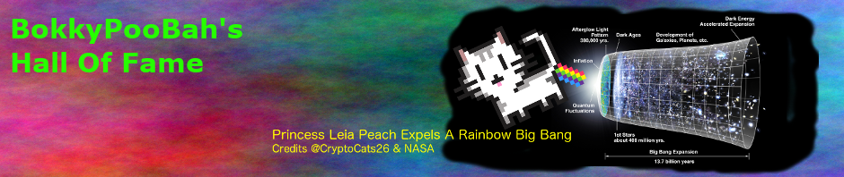

<kbd></kbd>

 

# BokkyPooBah's Hall Of Fame

1. Feb 05 2017 - [/u/JonnyLatte](https://www.reddit.com/user/JonnyLatte), the original TokenTraderFactory author, has found a bug in the TokenTraderFactory code when it interacts with the [🦄 ‐ Unicorn](https://github.com/bokkypoobah/TokenTrader/wiki/🦄-‐-Unicorn) token where the natural unit is 1.

    Here are the [diffs](https://github.com/bokkypoobah/TokenTrader/commit/376cdb1feccc4fb613daff9d6b0130b70cc942ce) of the fixed bug in in `TokenTraderFactory` and `TokenSellerFactory`

    <kbd></kbd>

2. Feb 14 2017 - [Bartosz Ocytko](https://github.com/bocytko) has found an overflow condition that allows the GNTTokenTrader, TokenTrader and TokenSeller contracts to exchange the tokens for very little ethers. The conditions for this situation to occur are very very unlikely as it requires:
    * the ERC20 token supply to be at least `2^256 - 1`
    * the Maker creates a TokenTrader or TokenSeller contract with `sellPrice = 2^256 - 1` and `units = 1`
    * the Maker transfers `2^256 - 1` tokens to the newly created contract

    **All** the existing GNTTokenTrader, TokenTrader and TokenSeller contracts as listed on the https://cryptoderivatives.market/ site are **safe** from the **overflow bug described above** as:
    * The are no tokens with supply `2^256 - 1`
    * If there was a token with supply `2^256 - 1`, it is even more unlikely that the Maker would own this whole amount
    * The GNTTokenTrader, TokenTrader and TokenSeller with `sellPrice = 2^256 - 1` will automatically get filtered out from the existing "reasonableness" checks

    Following is Ocytko's email detailing the overflow conditions:
    

    For his efforts of pointing out this condition and suggesting a fix, [40 ETH](https://etherscan.io/tx/0x4ddb60659cee7ef4c65616325c1f31fcba8787fa9a751f5480770c498e7c999d) has been awarded to Bartosz. Thanks Bartosz for auditing the contracts and helping keep it safe!

    <kbd></kbd>

3. Sep 23 2017 - [softestcore](https://www.reddit.com/user/softestcore) found a "minor" vulnerability in a separate bug bounty and has been awarded [3 ETH](https://etherscan.io/tx/0x3b39db0e4e9cec0804bc5199c3d24a6b8b856910e29954c9a30712a12ebb539c). Details will be included after the upstream owners of the source have been fully informed and have had time to rectify this issue if necessary.

4. Feb 9 2018 - Audit by [Oleksii Matiiasevych](https://github.com/lastperson) identified a major bug
  [#5 Incorrect parameter passed to ApproveAndCallFallBack() function](https://github.com/bokkypoobah/BokkyPooBahsTokenTeleportationServiceSmartContract/issues/5) and has been awarded [15 ETH](https://etherscan.io/tx/0x7f8383321d39087f45a9fe3a113ae5fdf63905bf9ff06d5b98994841e18772a0).

    <kbd></kbd>

5. Mar 8 2019 - [Rob Hitchens](https://github.com/rob-Hitchens) submitted a [set of performance and readability improvements](https://github.com/bokkypoobah/BokkyPooBahsRedBlackTreeLibrary/pull/1) to [BokkyPooBah's Red-Black Binary Search Tree Library](https://github.com/bokkypoobah/BokkyPooBahsRedBlackTreeLibrary) and has been awarded [5 ETH](https://etherscan.io/tx/0xdaeef0feb190cd19220d5e7a88d64348c05d9fe146ba4c43fc784261697c4a88).

    <kbd></kbd>

6. **{{Your Name Here?}}**

 

# Active Bug Bounties

Bok Consulting Pty Ltd is offering a 30 ETH bug bounty across the smart contracts in the following projects, with the scope defined in each project:

* [BokkyPooBah's Red-Black Binary Search Tree Library](https://github.com/bokkypoobah/BokkyPooBahsRedBlackTreeLibrary#bug-bounty-scope-and-donations)
* [BokkyPooBah's Gas-Efficient Solidity DateTime Library](https://github.com/bokkypoobah/BokkyPooBahsDateTimeLibrary#bug-bounty-scope-and-donations)
* [BokkyPooBah's Token Teleportation Service Smart Contract](https://github.com/bokkypoobah/BokkyPooBahsTokenTeleportationServiceSmartContract#bug-bounty-scope-and-donations)

Please DM any submissions to [BokkyPooBah @ Reddit](https://www.reddit.com/user/BokkyPooBah/) or [BokkyPooBah @ Twitter](https://twitter.com/BokkyPooBah).

 

## Rules And Rewards

* Previously submitted or known bugs are not eligible for bounty rewards
* Public disclosure of a vulnerability makes it ineligible for a bounty
* You can deploy the contracts on your private chain for bug hunting. Please respect the Ethereum Mainnet and Testnets and refrain from attacking them
* The value of rewards paid out will depend on the severity of the bugs found. Determinations of this amount is at the sole and final discretion of the Bok Consulting Pty Ltd but we will try to be fair

 

## Donations

Any donations to [0xb6dAC2C5A0222f6794265249ACE15568B750c2d1](https://etherscan.io/address/0xb6dAC2C5A0222f6794265249ACE15568B750c2d1) between the period of Jan to Jun 2019 will be added to this bug bounty program.

If you want to support the development of decentralised applications, please consider donating to the address above.

Alternatively, consider donating to the [Decentralised Future Fund](https://dffdao.org/) multisig at [0xb5fbae0361855617c58EF95a186889f0122e6642](https://etherscan.io/address/0xb5fbae0361855617c58EF95a186889f0122e6642) with funds used to promote decentralisation. In 2018, the DFF provided the funds for 10 individuals to attend [EdCon 2018](https://2018.edcon.io/), [Consensus 2018](https://www.coindesk.com/events/consensus-2018), the [Web3 Summit](https://www.web3summit.com/) and [Devcon4](https://devcon4.ethereum.org/) conferences.

 

And the following donations (thanks) are included in this bug bounty:

* [5,000 POLY](https://etherscan.io/tx/0xc5a658ea13530513871744da85703655e601cf1924e311c50ac0410b1e915d26) from [PolymathNetwork](https://github.com/PolymathNetwork)

 

 

Enjoy!

(c) BokkyPooBah / Bok Consulting Pty Ltd - Mar 8 2019. The MIT Licence.
