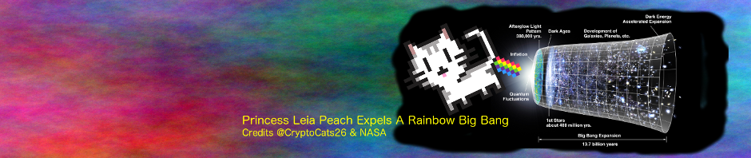

# BokkyPooBah's Hall Of Fame

<kbd></kbd>

 

1. Feb 05 2017 - [/u/JonnyLatte](https://www.reddit.com/user/JonnyLatte), the original TokenTraderFactory author, has found a bug in the TokenTraderFactory code when it interacts with the [🦄 ‐ Unicorn](https://github.com/bokkypoobah/TokenTrader/wiki/🦄-‐-Unicorn) token where the natural unit is 1.

    Here are the [diffs](https://github.com/bokkypoobah/TokenTrader/commit/376cdb1feccc4fb613daff9d6b0130b70cc942ce) of the fixed bug in in `TokenTraderFactory` and `TokenSellerFactory`

2. Feb 14 2017 - [Bartosz Ocytko](https://github.com/bocytko) has found an overflow condition that allows the GNTTokenTrader, TokenTrader and TokenSeller contracts to exchange the tokens for very little ethers. The conditions for this situation to occur are very very unlikely as it requires:
    * the ERC20 token supply to be at least `2^256 - 1`
    * the Maker creates a TokenTrader or TokenSeller contract with `sellPrice = 2^256 - 1` and `units = 1`
    * the Maker transfers `2^256 - 1` tokens to the newly created contract

    **All** the existing GNTTokenTrader, TokenTrader and TokenSeller contracts as listed on the https://cryptoderivatives.market/ site are **safe** from the **overflow bug described above** as:
    * The are no tokens with supply `2^256 - 1`
    * If there was a token with supply `2^256 - 1`, it is even more unlikely that the Maker would own this whole amount
    * The GNTTokenTrader, TokenTrader and TokenSeller with `sellPrice = 2^256 - 1` will automatically get filtered out from the existing "reasonableness" checks

    Following is Ocytko's email detailing the overflow conditions:
    

    For his efforts of pointing out this condition and suggesting a fix, [40 ETH](https://etherscan.io/tx/0x4ddb60659cee7ef4c65616325c1f31fcba8787fa9a751f5480770c498e7c999d) has been awarded to Bartosz. Thanks Bartosz for auditing the contracts and helping keep it safe!

3. Sep 23 2017 - [softestcore](https://www.reddit.com/user/softestcore) found a "minor" vulnerability in a separate bug bounty and has been awarded [3 ETH](https://etherscan.io/tx/0x3b39db0e4e9cec0804bc5199c3d24a6b8b856910e29954c9a30712a12ebb539c). Details will be included after the upstream owners of the source have been fully informed and have had time to rectify this issue if necessary.

4. Feb 9 2018 - Audit by [Oleksii Matiiasevych](https://github.com/lastperson) identified a major bug
  [#5 Incorrect parameter passed to ApproveAndCallFallBack() function](https://github.com/bokkypoobah/BokkyPooBahsTokenTeleportationServiceSmartContract/issues/5) and has been awarded [15 ETH](https://etherscan.io/tx/0x7f8383321d39087f45a9fe3a113ae5fdf63905bf9ff06d5b98994841e18772a0).

5. {{Your Name Here?}}
